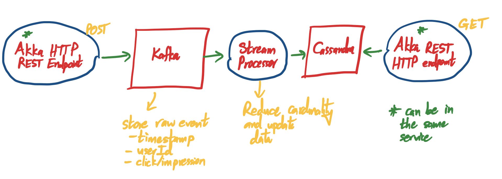

# Simple Analytics #

This system provides simple data analytics for a website. This system is able to answer the following 
questions:

- How many unique visitors have visited my site per hour?
- How many clicks per hour?
- How many impressions per hour?

## Running the system ##

The system is comprised of three distinct modules:

- __frontend__: provides ingestion and querying endpoints
- __clicks-and-impressions-stream-processor__: responsible for consuming click and impression events from the journal 
and aggregating them and pushing them to Cassandra
- __unique-users-stream-processor__: responsible for consuming events from the journal, aggregating them and performing 
cardinality estimation using HyperLogLog and pushing them to Cassandra

### Infrastructure ###

This system makes use of Cassandra to store analytics and Kafka for firehosing data and as a distribution mechanism for
decoupling modules. In order to spin up these dependencies, you can use
```bash
docker-compose up
```

#### Production-like setup ####
Now, we will package up the different components of the system to be used in a production-like environment:
```bash
sbt universal:packageBin
```

In each module's `target` folder, you will find a `universal` folder containing a `zip` artifact.
For example, if you want to run the `frontend` component:
```bash
cd frontend/target/universal
unzip frontend-0.1.0-SNAPSHOT.zip
cd frontend-0.1.0-SNAPSHOT
./bin/frontend
```

Run all the different components that make up the system:

- `frontend`
- `clicks-and-impressions-stream-processor`
- `unique-users-stream-processor`

## Notes ##



What are my queries?

- Unique number of users by timestamp
- Number of clicks by timestamp
- Number of impressions by timestamp

Note: to clarify when I say timestamp, I really mean year-month-date-hour

Some key points to note:
The GET request provides a timestamp, the period that they are looking at is 1 hour. So they want per-hour statistics 
for each metric.

So if the query comes in for `GET /analytics?timestamp=1519152523`
So the time asked for is `20/02/2018 6:48 PM` so you would need to report on metrics for `20/02/2018` `6:00PM` to `7:00PM`

Let's say we partitioned data by the hour, and we did at hourly intervals (so 1AM to 2AM, 2AM to 3AM and so on) then 
if someone asked for a query at that particular time (6:48 PM), we would report the 6PM-7PM interval.

Storing clicks and impression data can be done nicely with the help of Cassandra's Counter data-type.

Trying to figure out unique users is definitely more tricky. A naïve approach to doing this could be to store every 
user that visited the site.

Basically store all the user IDs in a thick partition and look them up to determine if they are already there. 
When you want to find out how many unique visitors you have, you do a sum of the rows. This has some pretty serious 
drawbacks if you get a large number of visitors and something will definitely break since a partition can hold up to a 
maximum of 2 billion rows. So if you get more than 2 billion, you will blow up the Cassandra partition.

I actually did some research on this and what we are trying to do is estimate data cardinality (i.e. how many unique 
entries of data are present). We don't need to be 100% accurate, we just need a good estimate and this is where 
algorithms like HyperLogLog and the Linear Probabilistic Counter come into play. They are able to provide you a great 
estimate using only 1/1000 of the space needed by the actual data and giving you error percentage within 10%. The more 
space you use for these data structures, the lower the error rate.

We'll take a simple per hour approach of bucketing data. So every hour, we will have a new partition. However, we'll go 
with skinny partitions. So to figure out the number of unique usernames per hour, we'll make use of __HyperLogLog__ (HLL). 

One problem with the table storing HLLs is that two updates A and B can come at the same time where they both read data 
X and they both change the HLL based on data X resulting in A' and B' and they persist the changes one after the other 
resulting in only one of the updates being persisted (either A' or B') when in fact we should have had the sum of all 
changes where B sees A' and takes that into account.

Databases like Riak have the concept of Application Side Conflict Resolution where the database will capture concurrent 
updates to a key and will present them to the application (aka us) to resolve. In our case, we are dealing with an HLL 
that has the options to do unions (it's actually a Monoid, take a look at Algebird's implementation) so we could easily 
merge the HLL representations that the database presents us and solve this ourselves. Note that Cassandra only supports 
Last-Write-Wins semantics so you cannot use Cassandra to do this. In order to get around this you would need a read-write 
transaction.

However, this isn’t good enough because if concurrent updates happen, they are not automatically linearized, they are 
actually denied and you will have to retry them manually. 

So for example, I read, I get X, okay I'm going to write X' only if X was in the last spot, if not then fail.
Employing Optimistic Locking with Version Number unfortunately won't cut it here as you will lose data.

The Stream Processor component could be something like Spark Streams, Flink or Akka Streams. We went with Akka Streams 
and Akka Streams Kafka. 

Essentially this component takes a batch of events (bigger the better) and condenses this down to a single event. Now 
I definitely glossed over this but I still plan to use HLL or an equivalent estimator to track unique counts because 
I'm processing the data as it comes in and I don't plan on processing data records for the hour all in memory unless I 
had something like a Spark Cluster. So you still end up having the same tables in Cassandra as above, we just do some 
optimizations to batch data (to minimize writes) and avoid getting into (as many) concurrency problems as we did before.
